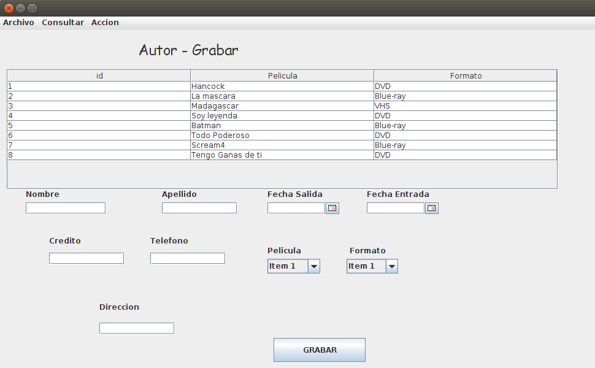

# RentaDeVideos
Proyecto en Java, muestra una simulación de la alquilación de vídeos o películas.

## ¿Cómo funciona?

Al ejecutar la aplicación, se muestra una ventana con varias opciones en la parte superior "Archivo->Salir, Consultar->Lista, Actor, cliente... y Acción->Grabar, eliminar..." (Imagen_1), la imagen muestra en este caso, la lista de todas las películas almacenadas en la base de datos "almacen". Dentro de otras opciones están las películas disponibles y "no" disponibles, los clientes activos, etc.

